<div align="center">
  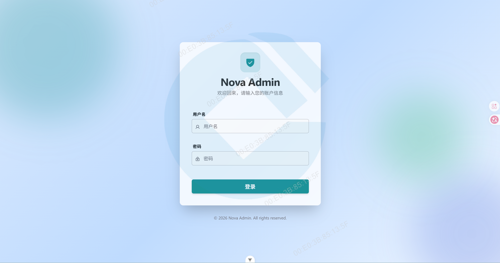
  
  # Nova Admin
  
  **🚀 基于 Nacos 构建的现代化配置与服务治理平台**
  
  [](https://vuejs.org/)
  [](https://vite.dev/)
  [](https://www.typescriptlang.org/)
  [](https://tailwindcss.com/)
  [](./LICENSE)
  
</div>

---

## 🔌 适配版本 (Compatibility)

| Nova Admin Version   | Nacos Backend Version   | Status            |
| -------------------- | ----------------------- | ----------------- |
| **v2.4.x** (Current) | **Nacos 2.4.0+**        | ✅ 完美适配       |
| **v2.3.x**           | **Nacos 2.3.0 ~ 2.3.2** | ⚠️ 部分特性不可用 |
| v1.x (Legacy)        | Nacos 1.x / 2.0.x       | ❌ 不再维护       |

---

## ✨ 项目介绍

**Nova Admin** 是一款基于 [Nacos](https://nacos.io/) 构建的现代化配置与服务管理平台，旨在为开发者和运维团队提供更直观、更高效、更美观的治理体验。

项目采用前沿前端技术栈，全面重构了 Nacos 原生控制台 UI，在保留核心功能的同时，带来了全新的视觉设计与交互体验。

## 🖼️ 功能预览

### 📊 工作台 (Workbench)

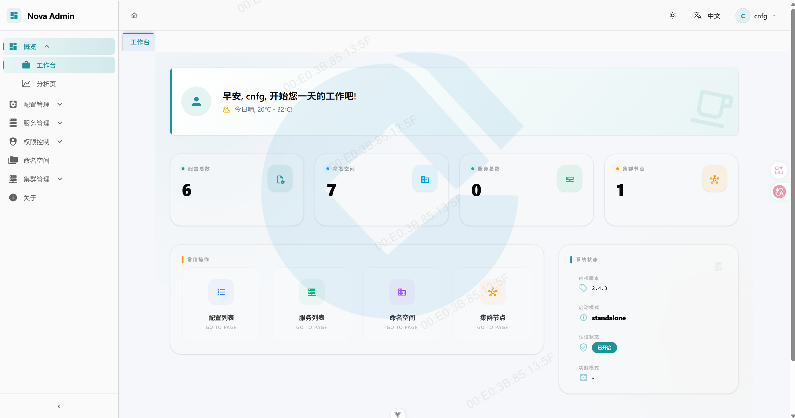

现代化的仪表盘首页，一览所有核心指标与快捷操作入口。

### 📋 配置管理 (Configuration)

**配置列表**
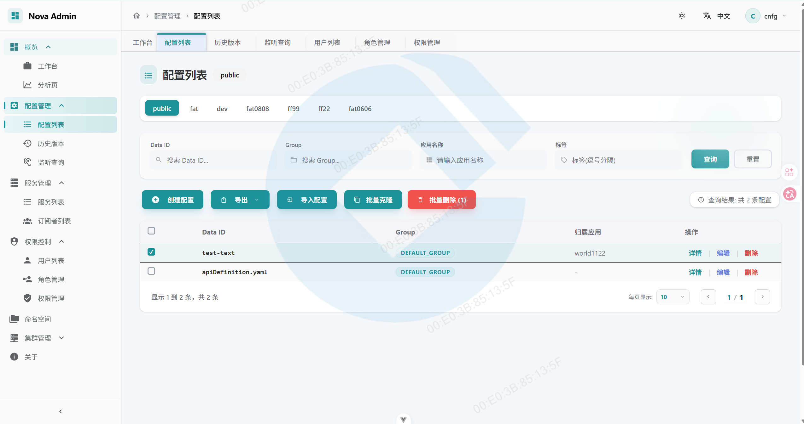

**创建配置**
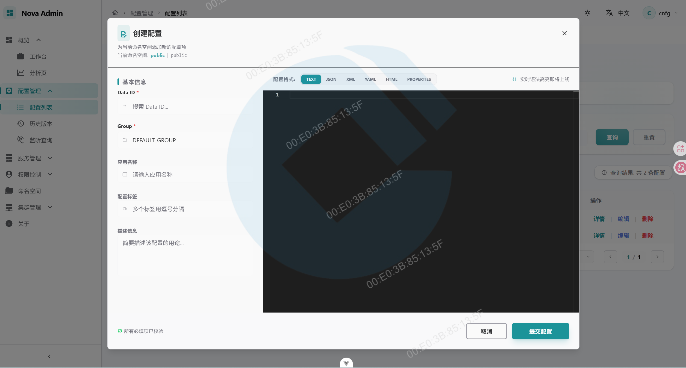

**配置详情**


**配置历史版本**
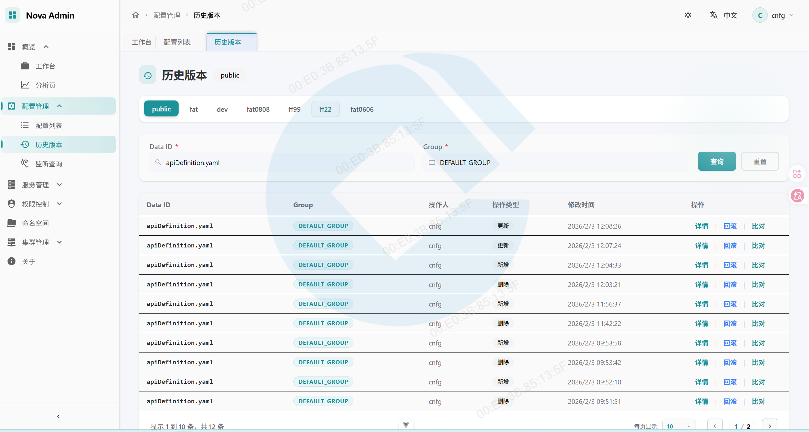

**配置历史详情**
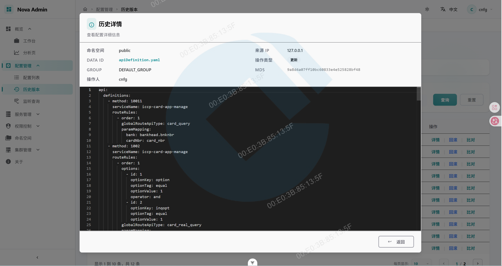

**配置版本比对**
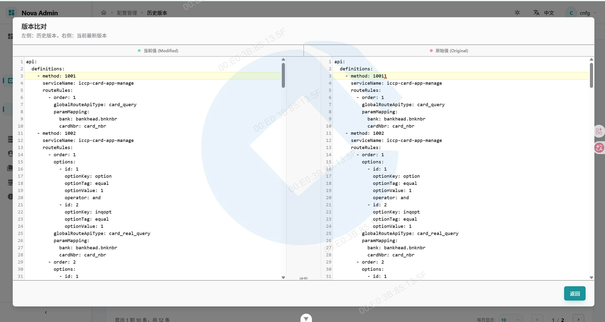

**配置回滚**
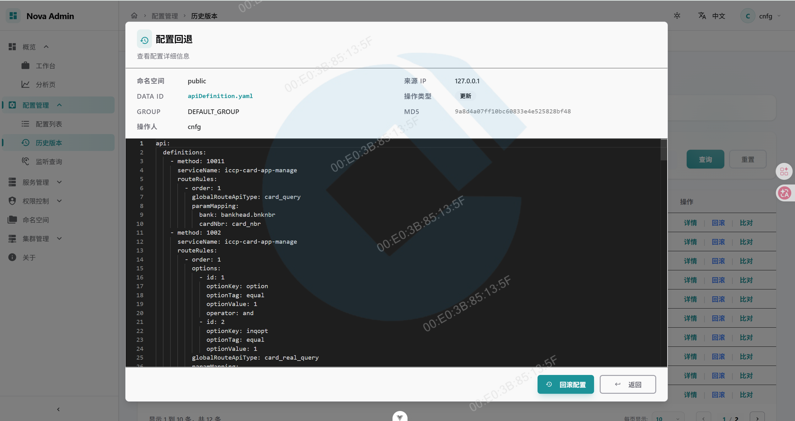

**配置克隆**
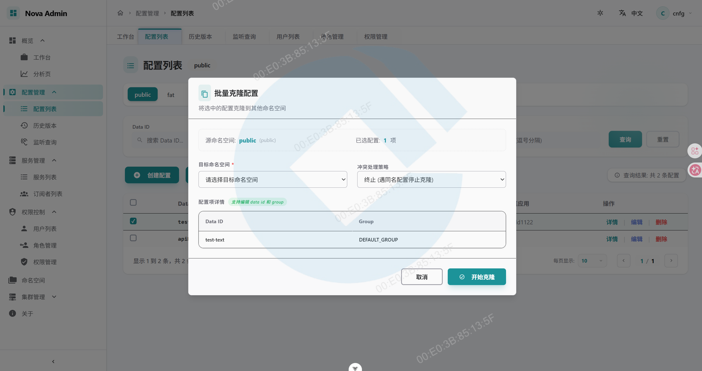

**配置导入**
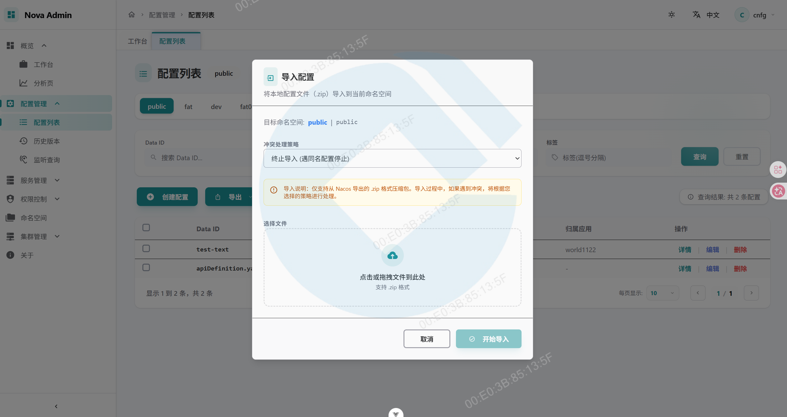

**配置监听查询**
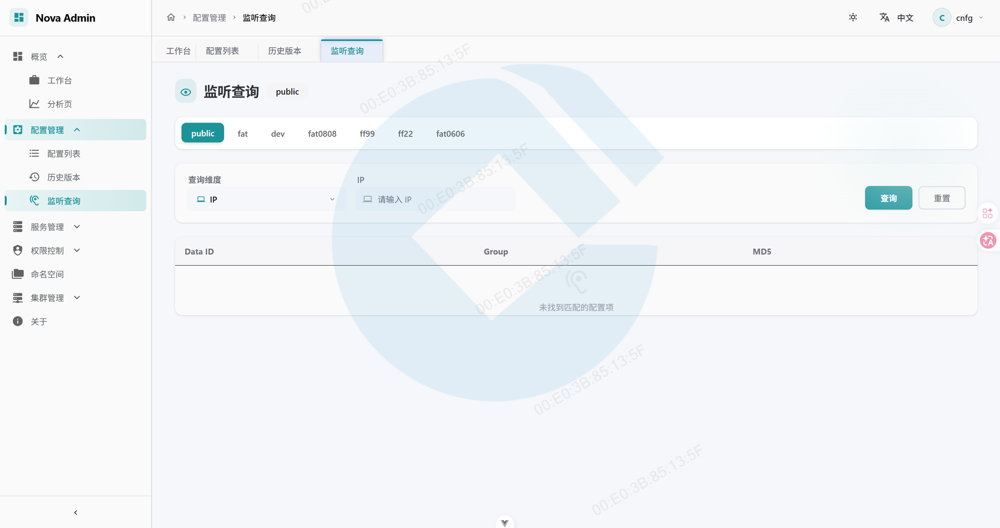

### 🗂️ 命名空间管理 (Namespace)

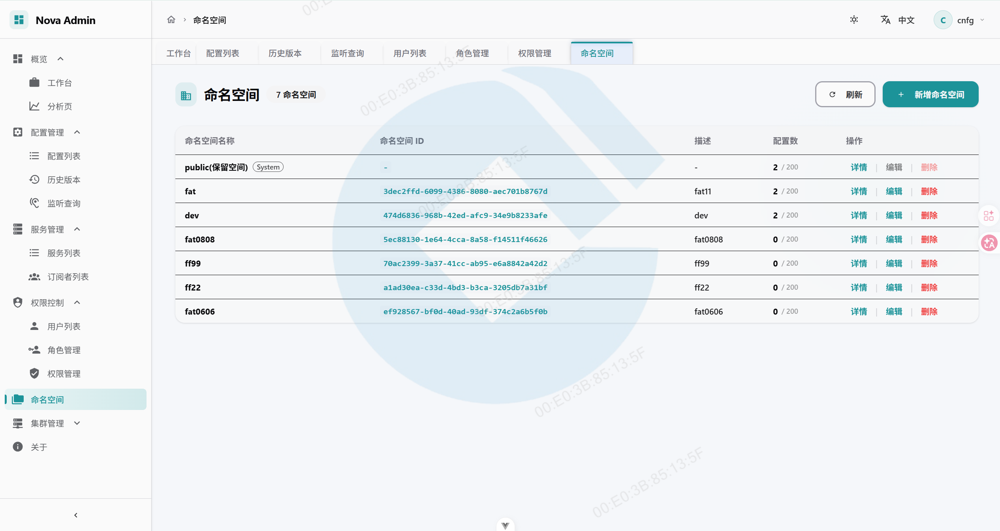

支持多命名空间的配置隔离与管理。

### 🌐 集群管理 (Cluster)

**节点列表**
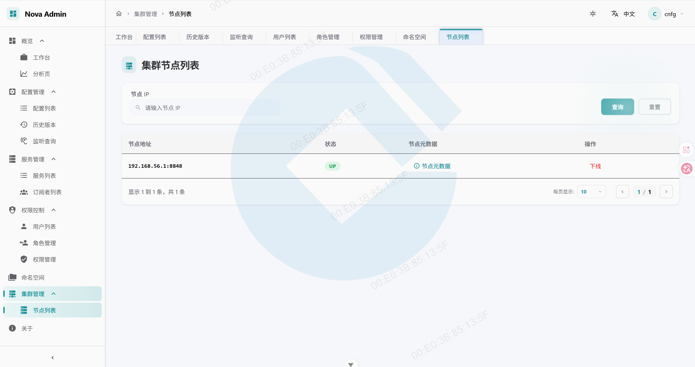

**节点元数据**


直观查看集群节点状态与分布情况。

### 🔐 权限控制 (Access Control)

**用户管理**
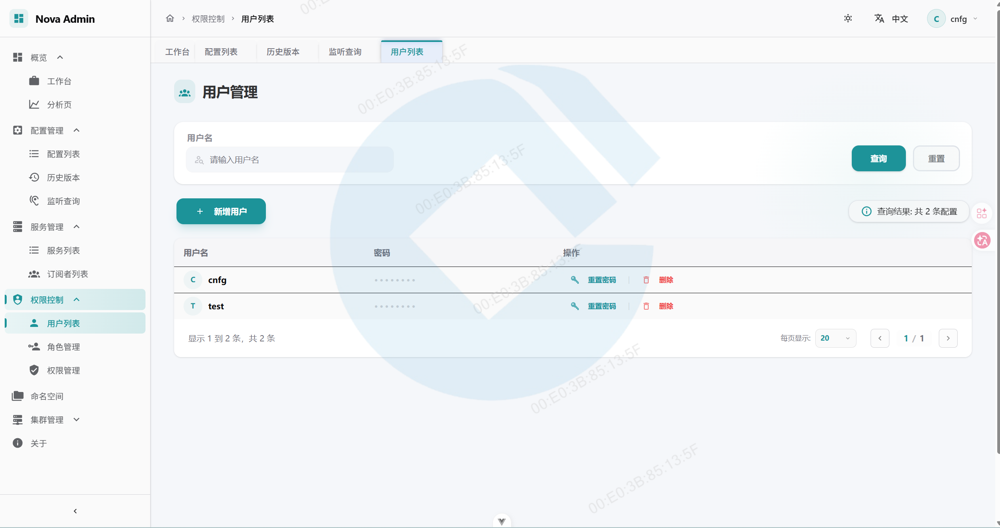

**角色管理**
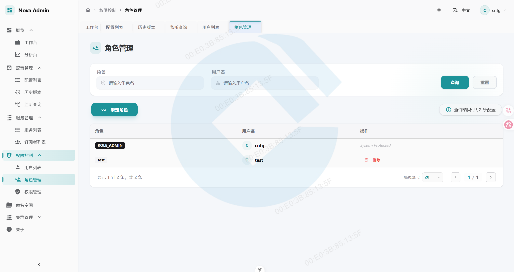

**权限管理**
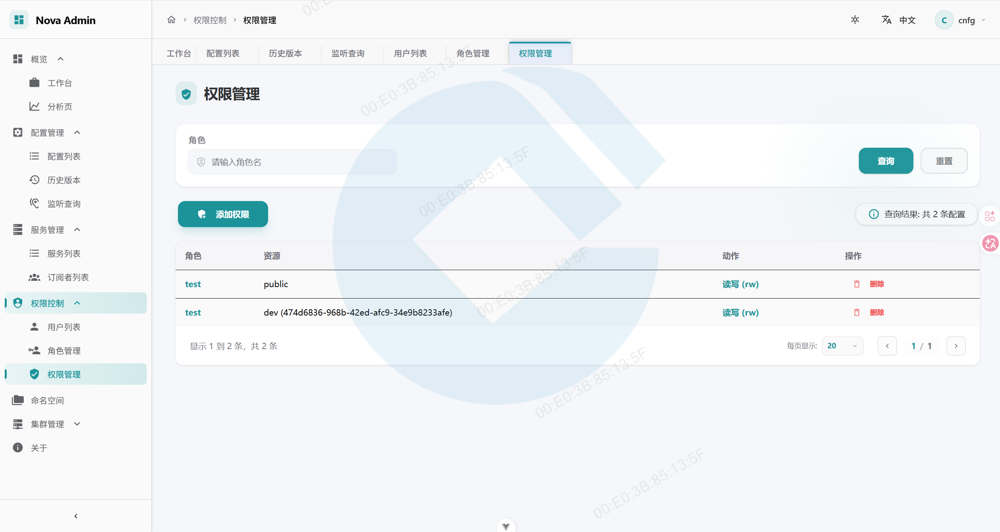

完善的 RBAC 权限控制体系。

---

## 🛠️ 技术栈

| 领域            | 技术选型                    |
| --------------- | --------------------------- |
| **核心框架**    | Vue 3 (Composition API)     |
| **构建工具**    | Vite 7                      |
| **类型系统**    | TypeScript 5                |
| **样式方案**    | Tailwind CSS + SCSS         |
| **UI 组件库**   | Shadcn Vue / Radix Vue      |
| **状态管理**    | Pinia (with persistedstate) |
| **国际化**      | Vue-i18n 11                 |
| **HTTP 客户端** | Axios                       |
| **路由**        | Vue Router 4                |
| **图标库**      | Iconify + Lucide            |
| **代码编辑器**  | Monaco Editor / CodeMirror  |

---

## 🚀 快速开始

### 环境要求

- **Node.js**: `>=22.12.0` 或 `^20.19.0`
- **pnpm**: 推荐使用 pnpm 作为包管理器

### 安装与运行

```bash
# 克隆项目
git clone https://gitee.com/xudong_zhang_c/vue3-nacos-admin.git
cd vue3-nacos-admin

# 安装依赖
pnpm install

# 启动开发服务器
pnpm dev
```

### 🃏 Mock 模式使用

项目内置了完整的 Mock 数据，支持在脱离后端的情况下进行前端开发。

**启动方式：**

```bash
# 直接使用预设好的 mock 模式启动（推荐）
pnpm dev:mock
```

**配置说明：**

- `pnpm dev:mock` 会自动加载 `.env.mock` 配置，并启用 `vite-plugin-mock` 插件。
- 如果想在常规开发模式下手动开启/关闭，可以修改 `.env.dev` 中的 `VITE_USE_MOCK` 为 `true` 或 `false`。
- 项目已统一请求路径，Mock 数据拦截路径与真实后端接口路径保持一致。

**验证方式：**

- **网络检查**：在浏览器开发者工具的 Network 标签页中，观察 `/api/v1/...` 请求是否正常返回数据。
- **数据联动**：
  - **权限联动**：`用户管理`、`角色管理` 与 `权限管理` 中的数据已通过 Mock 实现关联逻辑。
  - **环境联动**：切换命名空间后，配置列表会根据 `tenant` 参数返回对应的 Mock 模拟数据。

### 构建生产版本

```bash
# 开发环境构建
pnpm build:dev

# UAT 环境构建
pnpm build:uat

# 生产环境构建
pnpm build:prod
```

### 代码检查

```bash
# 运行 ESLint + OxLint
pnpm lint

# 代码格式化
pnpm format
```

---

## 📁 项目结构

```
src/
├── components/        # 公共组件
│   ├── ui/           # 基础 UI 组件 (Shadcn)
│   └── workbench/    # 工作台专用组件
├── http/             # HTTP 客户端封装
├── i18n/             # 国际化配置
├── layouts/          # 布局组件
├── pages/            # 页面视图
├── router/           # 路由配置
├── services/         # API 服务层
├── stores/           # Pinia 状态管理
├── styles/           # 全局样式
└── utils/            # 工具函数
```

---

## 🔧 推荐开发环境

### IDE 设置

- **[VS Code](https://code.visualstudio.com/)** + **[Vue (Official)](https://marketplace.visualstudio.com/items?itemName=Vue.volar)** 扩展
- 禁用 Vetur 以避免冲突

### 浏览器调试

- **Chrome / Edge**: 安装 [Vue.js devtools](https://chromewebstore.google.com/detail/vuejs-devtools/nhdogjmejiglipccpnnnanhbledajbpd)
- 启用 [Custom Object Formatter](http://bit.ly/object-formatters)

---

## 🌟 核心特性

- ✅ **现代化 UI** - 采用 Glassmorphism 设计语言，支持深浅主题切换
- ✅ **配置管理** - 支持多环境、多命名空间的配置管理与版本追踪
- ✅ **服务发现** - 实时监控服务注册状态与健康检查
- ✅ **集群治理** - 可视化集群节点状态与分布
- ✅ **权限控制** - 完善的 RBAC 用户/角色/权限管理
- ✅ **国际化** - 内置中英文双语支持
- ✅ **响应式** - 适配从桌面到移动端的各种屏幕尺寸

---

## 📄 开源协议

本项目基于 [MIT License](./LICENSE) 开源。

---

<div align="center">
  
  **💡 Made with ❤️ by Nova Admin Team**
  
  如果这个项目对你有帮助，请给我们一个 ⭐ Star!
  
</div>
